# CUSTOM-OLED-UI-

**CUSTOM OLED UI** is a modular, lightweight embedded user interface developed using the **U8g2 graphics library** on an **SH1106 OLED display**, running on an **ESP32 microcontroller**. Inspired by Android’s app drawer and minimalistic mobile OS layouts, this UI system supports tactile button navigation, buzzer feedback, WiFi scanning with pre-saved credentials, Bluetooth control, and an API-powered weather app.

---

## 🧠 Features

- 🔲 Android-like grid UI with app icons and system status bar
- 🪟 Splash screen and personalized welcome message
- 📶 WiFi scanning with SSID display, signal strength & auto-connect
- 📡 Bluetooth toggle interface (WIP)
- ☁️ Weather API app with detailed scrolling interface
- 🎛️ Tactile button-based UI navigation + buzzer feedback
- 🔋 Battery, WiFi, and Bluetooth indicators
- 🧩 Easily extendable with more "apps"

---

## 🔧 Hardware & Tools

| Component       | Description                         |
|----------------|-------------------------------------|
| MCU            | ESP32 DevKit or equivalent          |
| Display        | SH1106 128x64 OLED (I2C)            |
| Library        | [U8g2](https://github.com/olikraus/u8g2) |
| Input          | 2 Tactile switches (Navigation + Select) |
| Feedback       | Passive buzzer                      |
| Connectivity   | WiFi (native) + optional Bluetooth  |

---

## 📷 UI Walkthrough (Frame-by-Frame)

Each frame below illustrates one stage of the UI flow with an explanation of its function and user interaction.

---

### Frame 1: Initial Boot & Logo Display

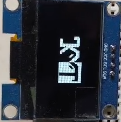

Displays a splash screen with a custom logo, mimicking mobile device boot animation. Indicates that the system is initializing.

---

### Frame 2: Welcome Screen

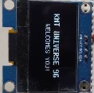

After boot, a personalized message such as **"KMT UNIVERSE 96 WELCOMES YOU!"** appears. This confirms initialization and greets the user.

---

### Frame 3: Main UI Dashboard (Android-like Home)

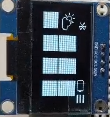

Main interface with:

- Status bar (Battery, WiFi, Bluetooth)
- App icons (2x4 grid)
- Navigation using one tactile switch; selection using another
- Buzzer feedback per press

---

### Frame 4: App Icon Grid Layout

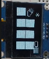

Shows a refined layout: 4 large icons in a 2x2 grid. Top right indicators show system status (brightness, wireless), bottom right shows battery.

---

### Frame 5: Icon Navigation Highlight

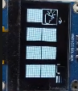

Cursor moves to highlight top-right icon. Indicates user navigation using tactile switch.

---

### Frame 6: Next Page of App Grid (Scrollable Layout)

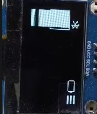

This frame demonstrates the ability to scroll horizontally (or paginate) through the app grid — just like Android's multi-page launcher. The UI now displays the next set of app icons, indicating expandable support for more apps beyond the initial grid. Tactile buttons are used to switch between pages, and the buzzer provides press feedback.

---

### Frame 7: Settings App Highlight

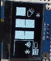

Bottom-left icon is highlighted—likely the settings area, which includes WiFi and Bluetooth management.

---

### Frame 8: Status Overview

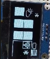

The dashboard shows Bluetooth, brightness, and battery status consistently—helping users monitor the system at a glance.

---

### Frame 9: WiFi Scan Screen

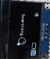

Displays “Scanning” message with a magnifying glass icon. Signals active search for available SSIDs.

---

### Frame 10: No Network Found

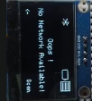

If no SSIDs are found, it displays “Oops! No Network Available!” with an option to re-scan.

---

### Frame 11: Available WiFi Networks

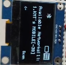

Lists available SSIDs with signal strength (e.g., **KMT**, **MOBILE [-30]**). Scroll through and select using tactile buttons.

---

### Frame 12: Connecting to WiFi

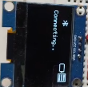

Displays “Connecting…” message as the device attempts to connect using pre-saved credentials.

---

### Frame 13: Dashboard After Connection

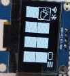

Once connected, user is returned to dashboard with status icons showing successful WiFi and/or Bluetooth connection.

---

### Frame 14: Weather App - Basic Info

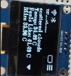

Displays weather info: "scattered clouds", temperature, "feels like", min/max values, all from API.

---

### Frame 15: Weather App - Scroll View

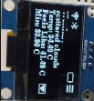

Content shifts upward as user scrolls to view more weather details. Demonstrates scroll logic.

---

### Frame 16: Weather App - Wind & Clouds

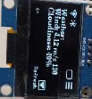

Additional weather info: wind speed, cloudiness. Includes “Refresh” option for updated data.

---

### Frame 17: Return to Main Dashboard

Returns to dashboard. Shows consistency and readiness for further interaction.

---

## 🚀 How It Works

1. Power on: Splash + Welcome screen appears  
2. Dashboard loads with tactile navigation  
3. WiFi can be scanned & connected  
4. Apps like Weather use online APIs  
5. Status indicators always visible for real-time feedback  
6. Buzzer confirms each press  
7. UI supports expandability with more app “tiles”

---

## 🛠️ Setup & Upload Instructions

1. Flash the code to ESP32 using Arduino IDE or PlatformIO  
2. Connect SH1106 OLED via I2C (default pins or configured in code)  
3. Attach 2 tactile switches and a buzzer  
4. Optionally connect HC-05 or BLE module for Bluetooth expansion  
5. Add your API key (e.g., OpenWeatherMap) inside the code  
6. Power on and enjoy the UI

---

## 📦 Future Plans

- Add Settings App  
- Full Bluetooth configuration screen  
- Add more apps (MQTT Monitor, Clock, Alarms, etc.)  
- EEPROM-based SSID password store  
- Touchscreen support (for TFT version)  
- OTA firmware updates (ESP32 only)

---

## 🪪 License

This project is licensed under the MIT License. See `LICENSE` file for details.

---

## ❤️ Author

Made with passion for embedded UI/UX  
by **KMT (KMT Universe 96)**  

